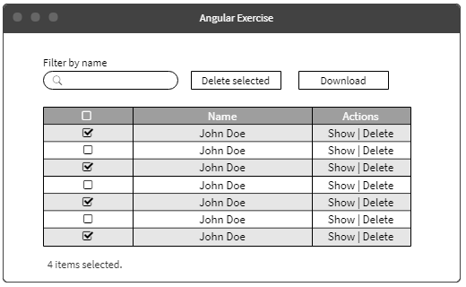
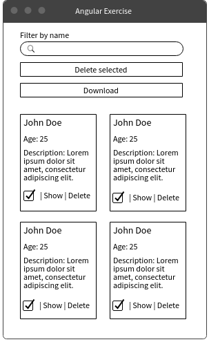

# Frontend React Test

### Overview
Imagine this is a MVP and additional features are already planned for the future. Try structuring the application in a way that **you can easily extend it when the time comes and reuse as much of the code you have already written** for this MVP.

For this, you can use any library that you want to help (e.g. Lodash, Axios, etc.)

### Requisites
* Create an app that displays all the info of the users.json file (it can be found on the root directory of this repository).

* The users should only be fetched once when the app starts. After that, we are working with users from *memory*, **but we need to take care that real backend can be easily added later**. The users list should be a React component and every row needs to have 3 actions:
	- Show – button that shows the user details in **another route**;
	- Delete – button that removes the user from the list;
	- Select – checkbox that selects its users.

  TIP: work with a state manager here!

* On the top of the list, place a button that removes the selected items from the list. The button are disabled while nothing is selected. Display the number of selected items;

* Also, on the top of the list, there should be a text input field that act as a filter by name for the list. Only names on the list  that contains the text on the input field they should be displayed. If the text input is empty, all the list entries are displayed. The list entries should be updated whenever the user changes the value of the input, without having to click anywhere to execute the action.

* Again, on the top of the list, there should be a download button, that downloads all the data of the selected items to a .csv or .json file.

* On the user details page, edition of the first and last name must be enabled and validated. Also, two buttons must be added: one for saving changes and another one for cancelling changes. If any data was changed in the form and the “Cancel” button is clicked, a Confirmation Modal must be displayed asking the user if he really wants to proceed with that action.

* If the user screen resolution width is lesser than 1024 pixels, the user list should be displayed in form of cards (e.g. Material Design cards) instead of a list. The cards would still have the same actions of the list row (show, delete and select). It’s up to you to decide how many cards can be displayed in one row of the container.

* Like all good applications, this one needs some tests too. Unit testing is **mandatory** for this application and the more, the better. Also, there is a need for **one automated UI test scenario**: after the list is loaded, the test should select one of the users and edit its first and last name and then, it should validate if the values were changed on the list. 

* Instructions on how to run the application should be added (it is fine to put them on the README.md).

### Examples
Here is an example of what the main screens should look like. They don’t have to be necessary like that, it is just to make easier to visualize what should be created with the exercise.

